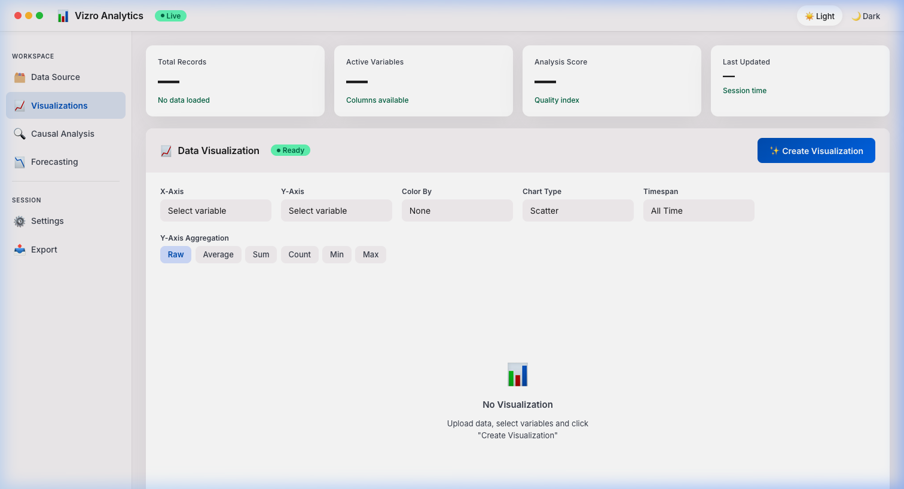
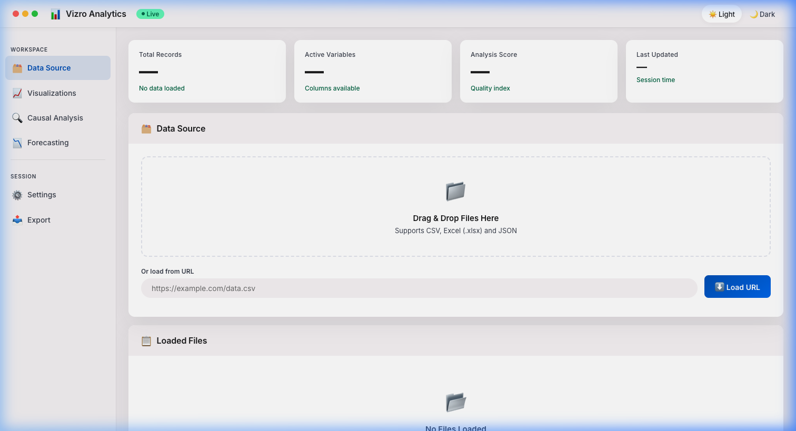
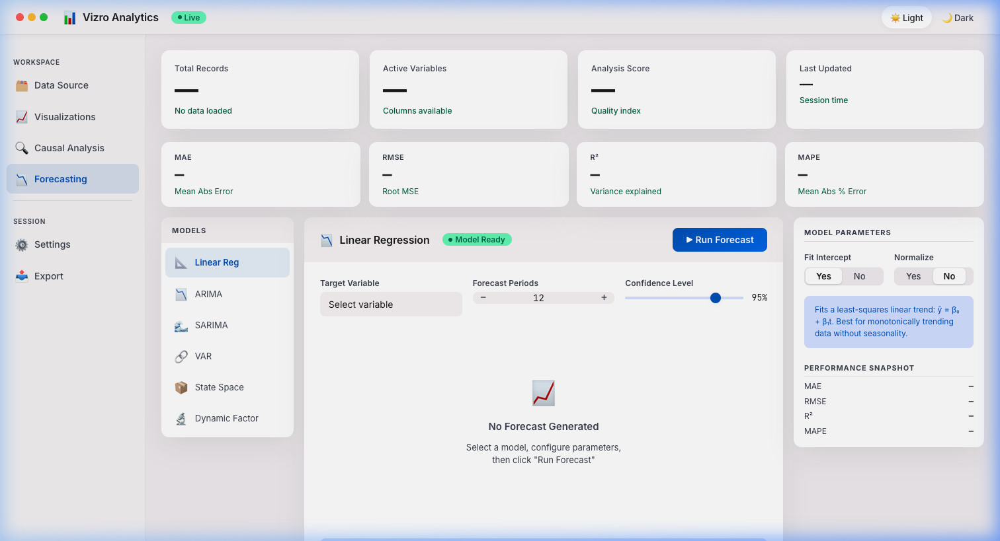
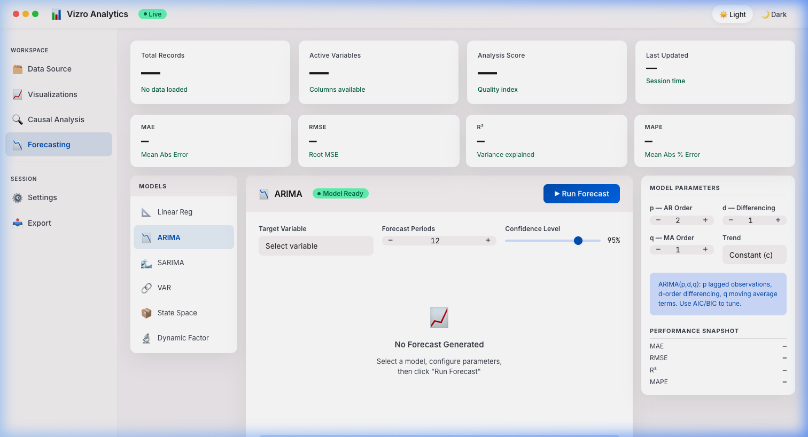

# Advanced Analytics Dashboard

A **professional, modular platform** for **advanced causal discovery**, **statistical analysis**, and **data visualization** with comprehensive **causal inference capabilities**, **forecasting models**, and **interactive visualizations**.

## Quick Start

### **Option 1: Gradio Web UI (default)**
```bash
uv sync
uv run python main.py
# or: python main.py --mode ui
```
Open **http://localhost:7860**

### **Option 2: FastAPI only**
```bash
python main.py --mode api
```
API at **http://localhost:8000**

### **Option 3: Mac Native App**
```bash
# Requires: pip install pywebview
python main.py --mode native
```
Launches a frameless macOS window wrapping the full dashboard UI via the FastAPI backend.

### **Option 4: Both API + UI**
```bash
python main.py --mode both
```

---

## Screenshots

### Web UI — Dashboard (Mac-Native Aesthetic)

> Unified design system: vibrancy glass sidebar, traffic-light controls, hairline separators, and high-density KPI row.

| Visualizations | Data Source |
|:---:|:---:|
|  |  |

### Forecasting Tab — Model Selection & Parameters

| Linear Regression + Model List | ARIMA Parameter Inspector |
|:---:|:---:|
|  |  |

> The Forecasting tab provides a **3-panel layout**: model source list (left) → forecast chart (center) → per-model parameter inspector (right). Supports: **Linear Regression · ARIMA · SARIMA · VAR · State Space · Dynamic Factor**.

---

## Project Architecture

The dashboard features a **professional, modular architecture** designed for scalability and maintainability. For more details, see the [Project Structure](#project-structure) section below.

---

## Powered by Advanced Technologies

This dashboard leverages **CausalNex** for causal inference and **Vizro** for professional data visualization. For a detailed explanation of the technologies used, see the [Technical Details](docs/TECHNICAL_DETAILS.md) documentation.

---

## Taipei District Analytics Showcase

The dashboard also supports complex regional economic data. Below are examples using the **taipei.csv** dataset, showcasing advanced visualization and causal discovery.

### **1. Professional Visualization Dashboard**
Analyzing **Disposable Income** vs. **Consumption Expenditure** across Taipei districts with interactive filtering and glassmorphism UI.

### **2. Advanced Causal Analysis**
Discovering the structural causal relationships between **Income**, **Savings**, **Consumption**, and **Household Size** using CausalNex.


---

## Sample Dataset: Comprehensive Sales Analytics

The dashboard includes a sophisticated **sales_data.csv** dataset designed to demonstrate all advanced features with realistic business complexity and embedded causal structures. For a deep dive into the causal structure and business logic of the sample data, see the [Deep Dive](docs/DEEP_DIVE.md) documentation.

---

## Key Features

- **Vizro-Enhanced Visualizations**: 6 advanced chart types powered by McKinsey's Vizro framework.
- **Interactive Localized Causal Analysis**: Directly analyze structural causal relationships between specific X, Y, and Color variables within the Visualizations tab. Features automated categorical factorization and missing-data imputation.
- **Comprehensive Forecasting Suite**: 7 advanced models for time series forecasting.
- **Advanced Causal Analysis**: 4 causal discovery methods, including intervention, pathway, and lag analysis.
- **Lag Analysis**: Discover time-delayed causal effects with cross-correlation and Granger causality testing.
- **Professional Data Tables**: Advanced filtering, sorting, and exporting capabilities.

---

## Lag Analysis - Time-Delayed Causal Discovery

### **Overview**
Lag analysis reveals **time-delayed causal relationships** between variables, answering critical questions like:
- "How long does it take for marketing spend to affect sales?"
- "What's the optimal lead time between policy changes and behavioral responses?"
- "Which economic indicators predict future outcomes?"

### **Key Capabilities**

#### **1. Cross-Correlation Analysis**
- Measures linear relationships at different time delays (lags 0 to N)
- Identifies optimal lag period with strongest correlation
- Visual bar chart showing correlation strength at each lag
- Helps determine "when" effects occur, not just "if" they occur

#### **2. Granger Causality Testing** *(Optional: requires statsmodels)*
- Statistical test for predictive causality
- Tests if past values of predictor help forecast target
- P-values for each lag period (significant if p < 0.05)
- Distinguishes true predictive relationships from spurious correlations

#### **3. Lagged Scatter Plots**
- Visual comparison of relationships at lags 0, 1, 2, 3
- Correlation coefficients displayed for each lag
- Identifies non-linear lagged patterns
- Helps validate cross-correlation findings

#### **4. Auto-Discovery Feature**
- **Automatically tests all variable pairs** in your dataset
- Identifies significant lagged relationships across entire system
- Network visualization of top relationships
- Configurable correlation threshold and maximum lags
- Perfect for exploratory analysis and hypothesis generation

### **Use Cases**

#### **Economic Analysis**
```
Question: How long does GDP growth take to affect consumption?
Result: Optimal lag = 3 months, correlation = 0.75
Insight: GDP changes affect consumption after 3-month delay
```

#### **Marketing Attribution**
```
Question: When do advertising campaigns impact sales?
Result: Optimal lag = 2 weeks, Granger p-value = 0.003
Insight: Ads significantly predict sales 2 weeks later
```

#### **Policy Impact Assessment**
```
Question: How quickly do policy changes affect compliance?
Result: Optimal lag = 4 months, correlation = 0.62
Insight: Policy effects emerge after 4-month adjustment period
```

#### **Supply Chain Optimization**
```
Question: What's the lead time between orders and inventory?
Result: Optimal lag = 5 days, correlation = 0.88
Insight: Orders affect inventory with 5-day delivery lag
```

### **How to Use**

1. **Navigate to "Lag Analysis" tab**
2. **For specific relationships:**
   - Select target variable (what you want to predict)
   - Select predictor variable (what might cause delays)
   - Set maximum lags to test (e.g., 10 time periods)
   - Click "Analyze Lags"

3. **For auto-discovery:**
   - Set maximum lags (1-10, default: 5)
   - Set correlation threshold (0.1-0.9, default: 0.3)
   - Click "Find All Significant Lags"
   - View network graph and ranked results

### **Interpretation Guide**

**Cross-Correlation Values:**
- `|r| > 0.7`: Strong lagged relationship
- `0.3 < |r| < 0.7`: Moderate lagged relationship
- `|r| < 0.3`: Weak lagged relationship

**Granger Causality P-values:**
- `p < 0.01`: Very strong evidence of predictive causality
- `0.01 < p < 0.05`: Significant predictive causality
- `p > 0.05`: No significant predictive causality

**Optimal Lag:**
- `Lag = 0`: Contemporaneous (same-time) relationship
- `Lag > 0`: Delayed effect (predictor leads target by N periods)
- Multiple significant lags: Complex dynamic relationship

### **Technical Requirements**

**Minimum Data:**
- At least `max_lags + 10` data points
- Example: max_lags=10 requires ≥20 data points
- Recommended: 50+ data points for robust results

**Optional Dependencies:**
```bash
# For Granger causality testing (highly recommended)
pip install statsmodels
```

**Performance:**
- Cross-correlation: Very fast (O(n × k))
- Granger test: Moderate (O(n × k²))
- Auto-discovery: Tests all pairs (up to 90 for 10 variables)

### **Output Visualizations**

1. **Cross-Correlation Bar Chart**: Shows correlation at each lag
2. **Lagged Scatter Plots**: 2×2 grid comparing lags 0-3
3. **Network Graph** (auto-discovery): Visual map of lagged relationships
4. **Results Table**: Ranked list of significant relationships
5. **Detailed Report**: Optimal lags, Granger tests, interpretation

### **Best Practices**

**Choose Appropriate Max Lags:**
- Daily data: 7-30 lags (1-4 weeks)
- Weekly data: 4-12 lags (1-3 months)
- Monthly data: 6-24 lags (6 months - 2 years)
- Quarterly data: 4-8 lags (1-2 years)

**Interpret with Caution:**
- Correlation ≠ causation (even with lags)
- Granger causality = predictive causality (not true causality)
- Consider confounding variables
- Use domain knowledge to validate findings

**Combine with Other Methods:**
- Use with standard causal analysis for complete picture
- Validate with intervention analysis
- Cross-check with domain expertise

---

## Project Structure

```
Advanced Analytics Dashboard
├── main.py                          # Entry point (ui / api / both / native)
├── requirements.txt                 # Dependencies
├── pyproject.toml                   # Project config (UV/pip)
├── README.md                        # This documentation
│
├── src/
│   ├── core/
│   │   ├── config.py                   # App-level config
│   │   ├── dashboard_config.py         # Constants, themes, model lists
│   │   └── data_handler.py             # Data loading & validation
│   │
│   ├── engines/
│   │   ├── causal_analysis.py          # Full causal discovery (NOTEARS)
│   │   ├── causal_discretization.py    # Variable discretization
│   │   ├── causal_engine.py            # Causal analysis orchestrator
│   │   ├── causal_intervention.py      # Bayesian intervention analysis
│   │   ├── causal_network_utils.py     # Network graph utilities
│   │   ├── forecasting_engine.py       # 8 forecasting models
│   │   ├── lag_analysis_engine.py      # Time-lag discovery
│   │   └── visualization_engine.py     # Plotly/Vizro chart generation
│   │
│   ├── ui/
│   │   ├── dashboard.py                # Gradio app & event wiring
│   │   ├── settings_manager.py         # Persistent user settings
│   │   ├── components/
│   │   │   ├── analysis_tab.py         # Causal / forecasting / lag tabs
│   │   │   ├── config_tab.py           # Data upload & config tab
│   │   │   └── visualization_tab.py    # Chart creation tab
│   │   └── frontend/                # Standalone HTML views (served by API)
│   │       ├── causal_analysis.html
│   │       ├── data_source.html
│   │       ├── forecasting.html
│   │       └── visualizations.html
│   │
│   ├── api/
│   │   └── routes.py                   # FastAPI endpoints (serves frontend + data)
│   │
│   └── utils/
│       └── data_generator.py           # Synthetic data generation
│
├── config/                          # Configuration files
├── assets/                          # Static assets
├── tests/                           # Test suite
└── docs/
    ├── DEEP_DIVE.md
    └── TECHNICAL_DETAILS.md
```

---

## Forecasting Models

| Model | Description | Requirements |
|---|---|---|
| Linear Regression | Trend-based baseline | scikit-learn |
| ARIMA | Auto-order ARIMA with AIC selection | statsmodels |
| SARIMA | Seasonal ARIMA | statsmodels |
| VAR | Multivariate vector autoregression | statsmodels |
| Dynamic Factor Model | PCA-based latent factor forecasting | scikit-learn |
| State-Space Model | Unobserved components (trend + seasonal) | statsmodels |
| Nowcasting | Exponential smoothing for short-term | built-in |
| LSTM | Deep learning sequence model | PyTorch |

---

## Installation & Support

All core dependencies are managed via `requirements.txt` or `uv sync`. Optional packages (`statsmodels`, `torch`, `pywebview`) unlock additional forecasting models, Granger causality testing, and the Mac native app mode.

For common issues and solutions, see [docs/TECHNICAL_DETAILS.md](docs/TECHNICAL_DETAILS.md).

---
