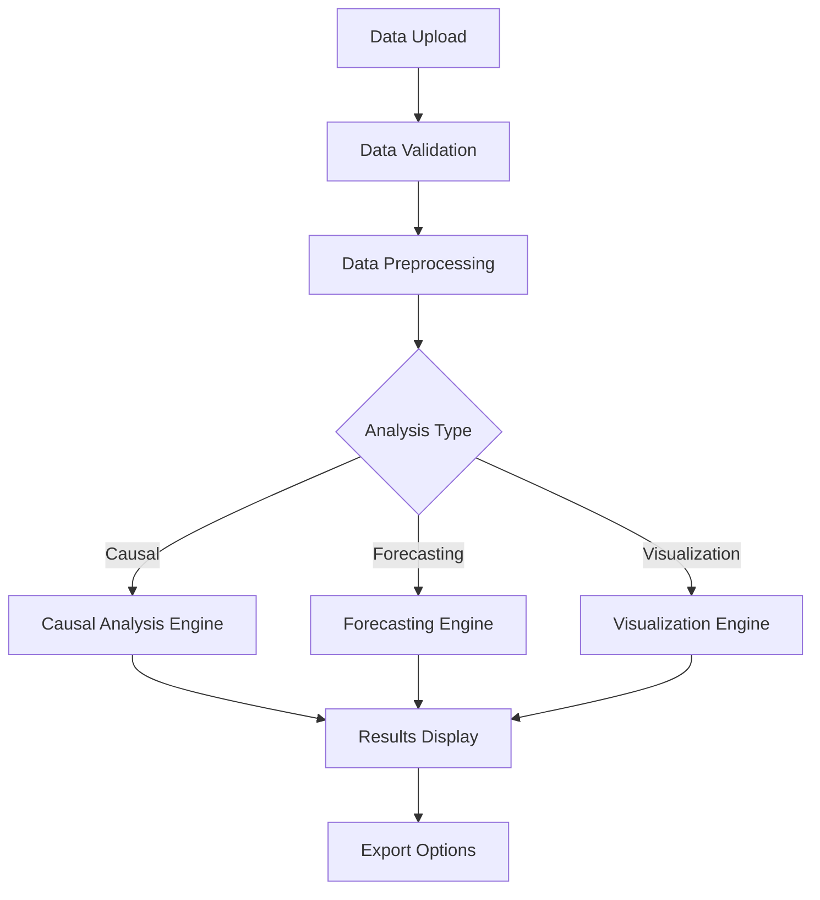

# Advanced Analytics Dashboard - Project Overview

## 🎯 Project Description

The Advanced Analytics Dashboard is a comprehensive data analysis platform that combines causal inference, time series forecasting, and interactive visualization capabilities. Built with Python and Gradio, it provides an intuitive web interface for complex analytical tasks.

## 🏗️ Architecture Overview

### Core Components

```
src/
├── core/                   # Core functionality and configuration
│   ├── config.py          # Global configuration management
│   ├── data_handler.py    # Data loading and preprocessing
│   └── dashboard_config.py # Legacy config (to be migrated)
├── engines/               # Analysis engines
│   ├── causal_engine.py   # Causal analysis and intervention
│   ├── forecasting_engine.py # Time series forecasting
│   └── visualization_engine.py # Data visualization
├── ui/                    # User interface components
│   ├── dashboard.py       # Main Gradio dashboard
│   └── settings_manager.py # Settings management
└── utils/                 # Utility functions
    └── data_generator.py  # Sample data generation
```

### Supporting Structure

```
tests/                     # Test suite
├── unit/                  # Unit tests
├── integration/           # Integration tests
└── fixtures/              # Test data and fixtures

docs/                      # Documentation
├── user-guide/            # User documentation
├── technical/             # Technical documentation
└── api/                   # API documentation

config/                    # Configuration files
└── dashboard_settings.json # Dashboard settings
```

## 🔧 Key Features

### 1. Causal Analysis Engine
- **Causal Discovery**: Automatic discovery of causal relationships using NOTEARS algorithm
- **Intervention Analysis**: Do-calculus for causal intervention effects
- **Network Visualization**: Interactive causal network graphs
- **Statistical Validation**: P-values, correlation coefficients, and significance testing

### 2. Forecasting Engine
- **Multiple Models**: ARIMA, Exponential Smoothing, Linear Regression
- **Automatic Model Selection**: Best model selection based on performance metrics
- **Confidence Intervals**: Prediction intervals for uncertainty quantification
- **Interactive Plots**: Plotly-based interactive forecasting visualizations

### 3. Visualization Engine
- **Multi-chart Support**: Line plots, scatter plots, histograms, heatmaps
- **Theme Support**: Light and dark themes
- **Interactive Features**: Zoom, pan, hover tooltips
- **Export Capabilities**: PNG, SVG, HTML export options

### 4. Data Management
- **Multiple Formats**: CSV, Excel, JSON support
- **Data Validation**: Automatic data quality checks
- **Preprocessing**: Missing value handling, outlier detection
- **Sample Data**: Built-in sample datasets for testing

## 🚀 Technology Stack

### Core Technologies
- **Python 3.8+**: Main programming language
- **Gradio**: Web interface framework
- **Pandas**: Data manipulation and analysis
- **NumPy**: Numerical computing
- **Plotly**: Interactive visualizations

### Analysis Libraries
- **CausalNex**: Causal inference and Bayesian networks
- **Scikit-learn**: Machine learning algorithms
- **Statsmodels**: Statistical modeling
- **NetworkX**: Graph analysis and visualization

### Development Tools
- **UV**: Python package management
- **Pytest**: Testing framework
- **Black**: Code formatting
- **Flake8**: Code linting

## 📊 Data Flow



## 🎨 User Interface Design

### Dashboard Layout
1. **Header**: Navigation and settings
2. **Data Upload**: File upload and data preview
3. **Analysis Tabs**: 
   - Causal Analysis
   - Forecasting
   - Data Visualization
4. **Results Panel**: Interactive results display
5. **Export Options**: Download results and reports

### Key UI Features
- **Responsive Design**: Works on desktop and tablet devices
- **Real-time Updates**: Live progress indicators during analysis
- **Error Handling**: User-friendly error messages and suggestions
- **Help System**: Contextual help and tooltips

## 🔒 Security Considerations

### Data Privacy
- **Local Processing**: All data processing happens locally
- **No Data Storage**: No persistent data storage on server
- **Session Isolation**: Each user session is isolated

### Input Validation
- **File Type Validation**: Only allowed file types accepted
- **Data Size Limits**: Reasonable limits on data size
- **Input Sanitization**: All user inputs are validated

## 📈 Performance Optimization

### Computational Efficiency
- **Smart Sampling**: Automatic data sampling for large datasets
- **Variable Selection**: Intelligent variable selection for analysis
- **Caching**: Results caching for repeated operations
- **Progress Tracking**: Real-time progress updates

### Memory Management
- **Efficient Data Structures**: Optimized pandas operations
- **Garbage Collection**: Proper cleanup of large objects
- **Resource Monitoring**: Memory usage tracking

## 🧪 Testing Strategy

### Test Coverage
- **Unit Tests**: Individual component testing
- **Integration Tests**: End-to-end workflow testing
- **Performance Tests**: Load and stress testing
- **UI Tests**: User interface functionality testing

### Quality Assurance
- **Automated Testing**: CI/CD pipeline integration
- **Code Review**: Peer review process
- **Documentation**: Comprehensive code documentation
- **Error Tracking**: Comprehensive error logging

## 🚀 Deployment Options

### Local Development
```bash
# Clone repository
git clone <repository-url>
cd advanced-analytics-dashboard

# Install dependencies
uv sync

# Run application
uv run python main.py
```

### Production Deployment
- **Docker**: Containerized deployment
- **Cloud Platforms**: AWS, GCP, Azure support
- **Load Balancing**: Multi-instance deployment
- **Monitoring**: Application performance monitoring

## 📚 Documentation Structure

### User Documentation
- **Getting Started Guide**: Quick start tutorial
- **User Manual**: Comprehensive usage guide
- **FAQ**: Frequently asked questions
- **Troubleshooting**: Common issues and solutions

### Technical Documentation
- **API Reference**: Detailed API documentation
- **Architecture Guide**: System architecture details
- **Development Guide**: Developer setup and guidelines
- **Deployment Guide**: Production deployment instructions

## 🔄 Future Roadmap

### Planned Features
- **Advanced ML Models**: Deep learning forecasting models
- **Real-time Data**: Streaming data support
- **Collaboration**: Multi-user collaboration features
- **API Integration**: REST API for external integration

### Performance Improvements
- **Distributed Computing**: Spark/Dask integration
- **GPU Acceleration**: CUDA support for large datasets
- **Advanced Caching**: Redis-based caching system
- **Optimization**: Algorithm performance improvements