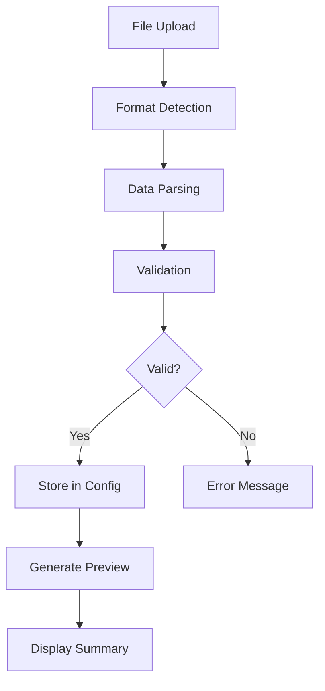
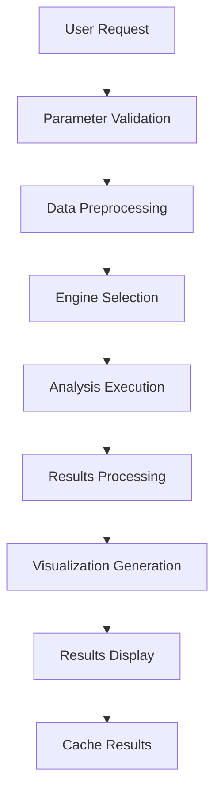
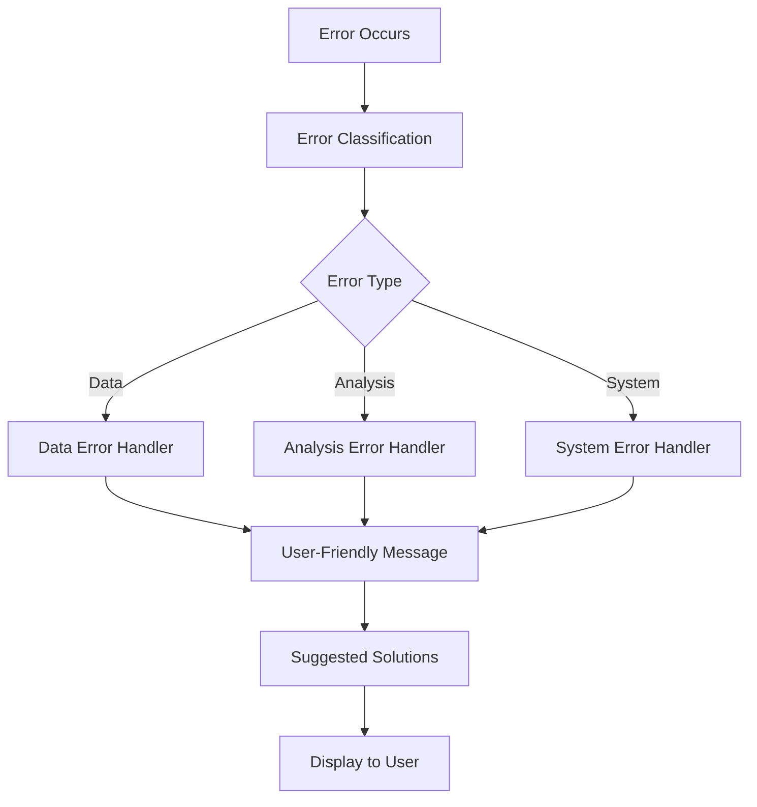

# System Architecture

## 🏗️ Architecture Overview

The Advanced Analytics Dashboard follows a modular, layered architecture designed for scalability, maintainability, and extensibility.

## 📐 Architectural Principles

### 1. Separation of Concerns
- **UI Layer**: Gradio interface components
- **Business Logic**: Analysis engines and algorithms
- **Data Layer**: Data handling and storage
- **Configuration**: Centralized settings management

### 2. Modularity
- **Independent Modules**: Each component can be developed and tested separately
- **Clear Interfaces**: Well-defined APIs between components
- **Pluggable Architecture**: Easy to add new analysis engines or UI components

### 3. Scalability
- **Horizontal Scaling**: Support for distributed processing
- **Vertical Scaling**: Efficient memory and CPU usage
- **Caching**: Results caching for performance optimization

## 🏛️ System Layers

```
┌─────────────────────────────────────────────────────────────┐
│                    Presentation Layer                        │
│  ┌─────────────────┐  ┌─────────────────┐  ┌──────────────┐ │
│  │   Gradio UI     │  │   Dashboard     │  │   Settings   │ │
│  │   Components    │  │   Interface     │  │   Manager    │ │
│  └─────────────────┘  └─────────────────┘  └──────────────┘ │
└─────────────────────────────────────────────────────────────┘
                                │
┌─────────────────────────────────────────────────────────────┐
│                    Business Logic Layer                     │
│  ┌─────────────────┐  ┌─────────────────┐  ┌──────────────┐ │
│  │   Causal        │  │   Forecasting   │  │ Visualization│ │
│  │   Engine        │  │   Engine        │  │   Engine     │ │
│  └─────────────────┘  └─────────────────┘  └──────────────┘ │
└─────────────────────────────────────────────────────────────┘
                                │
┌─────────────────────────────────────────────────────────────┐
│                      Core Layer                             │
│  ┌─────────────────┐  ┌─────────────────┐  ┌──────────────┐ │
│  │   Data          │  │   Configuration │  │   Utilities  │ │
│  │   Handler       │  │   Manager       │  │   & Helpers  │ │
│  └─────────────────┘  └─────────────────┘  └──────────────┘ │
└─────────────────────────────────────────────────────────────┘
                                │
┌─────────────────────────────────────────────────────────────┐
│                     Infrastructure Layer                    │
│  ┌─────────────────┐  ┌─────────────────┐  ┌──────────────┐ │
│  │   File System   │  │   Memory        │  │   External   │ │
│  │   Storage       │  │   Management    │  │   Libraries  │ │
│  └─────────────────┘  └─────────────────┘  └──────────────┘ │
└─────────────────────────────────────────────────────────────┘
```

## 🔧 Component Architecture

### Core Components

#### 1. Configuration Management
```python
# Centralized configuration
class DashboardConfig:
    - current_data: DataFrame storage
    - analysis_results: Results caching
    - user_preferences: Settings management
    - system_parameters: Performance tuning
```

#### 2. Data Handler
```python
# Data operations
class DataHandler:
    - load_data(): File parsing and validation
    - validate_data(): Quality checks
    - preprocess_data(): Cleaning and transformation
    - get_column_info(): Metadata extraction
```

### Analysis Engines

#### 1. Causal Analysis Engine
```python
# Causal inference pipeline
CausalAnalysisEngine:
    ├── Structure Discovery (NOTEARS)
    ├── Statistical Validation (Correlation, P-values)
    ├── Network Visualization (NetworkX + Plotly)
    ├── Intervention Analysis (Do-calculus)
    └── Results Export (CSV, JSON)
```

#### 2. Forecasting Engine
```python
# Time series forecasting
ForecastingEngine:
    ├── Model Selection (ARIMA, Exponential, Linear)
    ├── Automatic Parameter Tuning
    ├── Cross-validation
    ├── Confidence Intervals
    └── Performance Metrics (MAE, RMSE, MAPE)
```

#### 3. Visualization Engine
```python
# Interactive visualizations
VisualizationEngine:
    ├── Chart Types (Line, Scatter, Histogram, etc.)
    ├── Theme Management (Light/Dark)
    ├── Interactive Features (Zoom, Pan, Hover)
    └── Export Options (PNG, SVG, HTML)
```

### UI Components

#### 1. Dashboard Interface
```python
# Main Gradio interface
Dashboard:
    ├── Data Upload Section
    ├── Analysis Tabs
    │   ├── Causal Analysis
    │   ├── Forecasting
    │   └── Visualization
    ├── Results Display
    └── Export Options
```

#### 2. Settings Manager
```python
# User preferences and configuration
SettingsManager:
    ├── Theme Settings
    ├── Performance Parameters
    ├── Export Preferences
    └── Analysis Defaults
```

## 🔄 Data Flow Architecture

### 1. Data Ingestion Flow


### 2. Analysis Flow


### 3. Error Handling Flow


## 🗄️ Data Architecture

### 1. Data Storage Strategy
```python
# In-memory storage for session data
SessionStorage:
    ├── current_data: pd.DataFrame
    ├── processed_data: pd.DataFrame
    ├── analysis_cache: Dict[str, Any]
    └── user_settings: Dict[str, Any]

# Persistent storage for configuration
PersistentStorage:
    ├── dashboard_settings.json
    ├── user_preferences.json
    └── analysis_templates.json
```

### 2. Data Processing Pipeline
```python
# Data transformation pipeline
DataPipeline:
    Raw Data → Validation → Cleaning → Transformation → Analysis Ready
    
    Steps:
    1. Format Detection (CSV, Excel, JSON)
    2. Schema Validation (columns, types, ranges)
    3. Quality Checks (missing values, outliers)
    4. Preprocessing (normalization, encoding)
    5. Feature Engineering (if needed)
```

## 🔐 Security Architecture

### 1. Data Security
- **Local Processing**: All data remains on user's machine
- **No Persistence**: Data not stored permanently on server
- **Session Isolation**: Each user session is completely isolated
- **Input Validation**: All inputs validated and sanitized

### 2. Application Security
```python
SecurityLayers:
    ├── Input Validation
    │   ├── File Type Checking
    │   ├── Size Limits
    │   └── Content Validation
    ├── Error Handling
    │   ├── Safe Error Messages
    │   ├── No Information Leakage
    │   └── Graceful Degradation
    └── Resource Management
        ├── Memory Limits
        ├── CPU Throttling
        └── Timeout Controls
```

## ⚡ Performance Architecture

### 1. Optimization Strategies
```python
PerformanceOptimizations:
    ├── Data Sampling
    │   ├── Automatic sampling for large datasets
    │   ├── Stratified sampling for representative results
    │   └── User-configurable sample sizes
    ├── Caching
    │   ├── Results caching for repeated operations
    │   ├── Intermediate computation caching
    │   └── Smart cache invalidation
    ├── Parallel Processing
    │   ├── Multi-threading for I/O operations
    │   ├── Vectorized operations with NumPy/Pandas
    │   └── Asynchronous processing where possible
    └── Memory Management
        ├── Efficient data structures
        ├── Garbage collection optimization
        └── Memory usage monitoring
```

### 2. Scalability Considerations
```python
ScalabilityFeatures:
    ├── Horizontal Scaling
    │   ├── Stateless design
    │   ├── Load balancer support
    │   └── Distributed processing capability
    ├── Vertical Scaling
    │   ├── Efficient algorithms
    │   ├── Memory optimization
    │   └── CPU utilization optimization
    └── Resource Monitoring
        ├── Performance metrics collection
        ├── Resource usage tracking
        └── Automatic optimization
```

## 🧪 Testing Architecture

### 1. Testing Strategy
```python
TestingLayers:
    ├── Unit Tests
    │   ├── Individual component testing
    │   ├── Mock dependencies
    │   └── Edge case coverage
    ├── Integration Tests
    │   ├── Component interaction testing
    │   ├── End-to-end workflows
    │   └── API contract testing
    ├── Performance Tests
    │   ├── Load testing
    │   ├── Stress testing
    │   └── Memory leak detection
    └── UI Tests
        ├── User interaction testing
        ├── Cross-browser compatibility
        └── Accessibility testing
```

### 2. Quality Assurance
```python
QualityAssurance:
    ├── Code Quality
    │   ├── Static analysis (Flake8, mypy)
    │   ├── Code formatting (Black)
    │   └── Documentation coverage
    ├── Test Coverage
    │   ├── Minimum 80% coverage requirement
    │   ├── Critical path 100% coverage
    │   └── Regular coverage reporting
    └── Continuous Integration
        ├── Automated testing on commits
        ├── Performance regression detection
        └── Security vulnerability scanning
```

## 🚀 Deployment Architecture

### 1. Deployment Options
```python
DeploymentStrategies:
    ├── Local Development
    │   ├── Direct Python execution
    │   ├── Virtual environment isolation
    │   └── Hot reloading for development
    ├── Containerized Deployment
    │   ├── Docker containerization
    │   ├── Multi-stage builds
    │   └── Resource constraints
    ├── Cloud Deployment
    │   ├── Platform-as-a-Service (Heroku, Railway)
    │   ├── Container orchestration (Kubernetes)
    │   └── Serverless options (AWS Lambda)
    └── Enterprise Deployment
        ├── On-premises installation
        ├── High availability setup
        └── Load balancing configuration
```

### 2. Infrastructure Requirements
```python
InfrastructureNeeds:
    ├── Compute Resources
    │   ├── CPU: 2+ cores recommended
    │   ├── Memory: 4GB+ RAM
    │   └── Storage: 1GB+ free space
    ├── Network Requirements
    │   ├── HTTP/HTTPS support
    │   ├── WebSocket support (for real-time updates)
    │   └── File upload capabilities
    └── Dependencies
        ├── Python 3.8+ runtime
        ├── Required Python packages
        └── System libraries (if any)
```

## 🔄 Extension Architecture

### 1. Plugin System Design
```python
PluginArchitecture:
    ├── Analysis Engine Plugins
    │   ├── Custom analysis algorithms
    │   ├── External library integrations
    │   └── Domain-specific analyses
    ├── Visualization Plugins
    │   ├── Custom chart types
    │   ├── Interactive widgets
    │   └── Export format extensions
    ├── Data Source Plugins
    │   ├── Database connectors
    │   ├── API integrations
    │   └── Real-time data streams
    └── UI Component Plugins
        ├── Custom input components
        ├── Results display widgets
        └── Navigation extensions
```

### 2. API Extension Points
```python
ExtensionPoints:
    ├── Data Processing Hooks
    │   ├── Pre-processing filters
    │   ├── Custom validation rules
    │   └── Data transformation pipelines
    ├── Analysis Hooks
    │   ├── Custom analysis engines
    │   ├── Result post-processing
    │   └── Performance optimizations
    └── UI Hooks
        ├── Custom themes
        ├── Additional tabs/sections
        └── Export format handlers
```

## 📊 Monitoring Architecture

### 1. Application Monitoring
```python
MonitoringComponents:
    ├── Performance Metrics
    │   ├── Response time tracking
    │   ├── Memory usage monitoring
    │   └── CPU utilization tracking
    ├── Error Tracking
    │   ├── Exception logging
    │   ├── Error rate monitoring
    │   └── User error reporting
    ├── Usage Analytics
    │   ├── Feature usage statistics
    │   ├── User behavior tracking
    │   └── Performance bottleneck identification
    └── Health Checks
        ├── System health monitoring
        ├── Dependency availability checks
        └── Resource availability monitoring
```

### 2. Logging Strategy
```python
LoggingArchitecture:
    ├── Structured Logging
    │   ├── JSON format for machine parsing
    │   ├── Consistent log levels
    │   └── Contextual information
    ├── Log Categories
    │   ├── Application logs
    │   ├── Performance logs
    │   ├── Error logs
    │   └── Audit logs
    └── Log Management
        ├── Log rotation
        ├── Retention policies
        └── Log aggregation
```